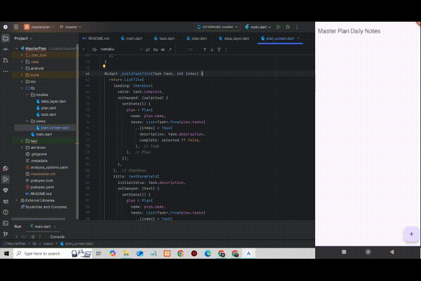

# masterplan

A new Flutter project - Managing State in Flutter

## GIF PRAKTIKUM 1

## GIF PRAKTIKUM 2

## GIF PRAKTIKUM 3

## SOAL PRAKTIKUM DAN JAWABAN
## SOAL

Tugas Praktikum 1: Dasar State dengan Model-View
Selesaikan langkah-langkah praktikum tersebut, lalu dokumentasikan berupa GIF hasil akhir praktikum beserta penjelasannya di file README.md! Jika Anda menemukan ada yang error atau tidak berjalan dengan baik, silahkan diperbaiki.
2.  Jelaskan maksud dari langkah 4 pada praktikum tersebut! Mengapa dilakukan demikian?
3.  Mengapa perlu variabel plan di langkah 6 pada praktikum tersebut? Mengapa dibuat konstanta ?
4.  Lakukan capture hasil dari Langkah 9 berupa GIF, kemudian jelaskan apa yang telah Anda buat!
5.  Apa kegunaan method pada Langkah 11 dan 13 dalam lifecyle state ?

Tugas Praktikum 2: InheritedWidget
1.  Selesaikan langkah-langkah praktikum tersebut, lalu dokumentasikan berupa GIF hasil akhir praktikum beserta penjelasannya di file README.md! Jika Anda menemukan ada yang error atau tidak berjalan dengan baik, silakan diperbaiki sesuai dengan tujuan aplikasi tersebut dibuat.
2.  Jelaskan mana yang dimaksud InheritedWidget pada langkah 1 tersebut! Mengapa yang digunakan InheritedNotifier?
3.  Jelaskan maksud dari method di langkah 3 pada praktikum tersebut! Mengapa dilakukan demikian?
4.  Lakukan capture hasil dari Langkah 9 berupa GIF, kemudian jelaskan apa yang telah Anda buat!

Tugas Praktikum 3: State di Multiple Screens
1. Selesaikan langkah-langkah praktikum tersebut, lalu dokumentasikan berupa GIF hasil akhir praktikum beserta penjelasannya di file README.md! Jika Anda menemukan ada yang error atau tidak berjalan dengan baik, silahkan diperbaiki sesuai dengan tujuan aplikasi tersebut dibuat.
2. Berdasarkan Praktikum 3 yang telah Anda lakukan, jelaskan maksud dari gambar diagram berikut ini!
3. Lakukan capture hasil dari Langkah 14 berupa GIF, kemudian jelaskan apa yang telah Anda buat!

## SOAL PRAKTIKUM DAN JAWABAN
## JAWABAN

Jawaban Praktikum 1

1. Telah Terselesaikan Tanpa Error

2. Jelaskan maksud dari langkah 4 pada praktikum tersebut! Mengapa dilakukan demikian?

Langkah 4 menjelaskan tentang pembuatan model data dasar yaitu `Task` dan `Plan`. Model ini digunakan untuk memisahkan logika data dari tampilan (UI). 
- `Task` merepresentasikan satu tugas yang memiliki deskripsi dan status selesai (complete).
- `Plan` adalah kumpulan dari beberapa task, yang memiliki nama dan daftar tugas (tasks).

Langkah ini dilakukan agar data lebih terstruktur, mudah digunakan, dan mendukung pengelolaan state yang baik di aplikasi Flutter. Pendekatan ini juga sesuai dengan prinsip pemrograman yang baik yaitu separation of concerns dan memudahkan proses pengujian serta pemeliharaan aplikasi di masa depan.

3. Mengapa perlu variabel plan di langkah 6 pada praktikum tersebut? Mengapa dibuat konstanta?

Variabel `plan` digunakan untuk menyimpan data state aplikasi saat ini, yaitu daftar tugas yang ditampilkan dan dimodifikasi pada layar. Saat pengguna menambahkan, mengedit, atau mencentang tugas, semua perubahan akan disimpan dalam variabel `plan`.

Variabel ini dibuat sebagai konstanta (`const`) karena kelas `Plan` dan `Task` bersifat immutable (tidak dapat diubah). Untuk mengubah isinya, kita perlu membuat objek baru. Dengan menggunakan `const`, kita menjamin bahwa objek tersebut tidak akan berubah sembarangan dan mendukung optimalisasi performa oleh Flutter saat membangun ulang UI.

4. Lakukan capture hasil dari Langkah 9 berupa GIF, kemudian jelaskan apa yang telah Anda buat!

Pada langkah 9, aplikasi telah dapat menambahkan daftar tugas menggunakan tombol tambah (+). Ketika tombol ditekan, sebuah task kosong ditambahkan ke daftar. Pengguna kemudian dapat mengisi deskripsi tugas dan mencentang kotak untuk menandai tugas tersebut telah selesai.

GIF yang diambil memperlihatkan:
- Pengguna menekan tombol tambah untuk menambahkan task baru.
- Pengguna mengetik deskripsi di setiap task.
- Pengguna mencentang dan menghapus centang dari task sesuai status penyelesaian.

Fitur ini memperlihatkan penerapan konsep state management di Flutter, di mana perubahan data (state) secara otomatis menyebabkan tampilan (UI) diperbarui menggunakan `setState`.

5. Apa kegunaan method pada Langkah 11 dan 13 dalam lifecyle state?

Langkah 11 menggunakan method `initState()` yang merupakan bagian dari lifecycle `State` di Flutter. Method ini dipanggil sekali saat state pertama kali dibuat. Dalam praktikum ini, digunakan untuk menginisialisasi `ScrollController` dan menambahkan listener agar keyboard ditutup otomatis saat pengguna melakukan scroll (terutama di perangkat iOS).

Langkah 13 menggunakan method `dispose()` yang juga bagian dari lifecycle `State`. Method ini dipanggil saat state akan dihapus dari widget tree. Fungsinya untuk membersihkan sumber daya yang digunakan, dalam hal ini untuk memanggil `dispose()` pada `ScrollController` agar tidak terjadi memory leak.

Kedua method ini penting untuk pengelolaan resource secara efisien dan memastikan aplikasi tetap stabil dan optimal.

Jawaban Praktikum 2

# 📘 Jawaban Praktikum 1: Model-View (StatefulWidget)

## ✅ 1. Status Pengerjaan

- Telah Terselesaikan Tanpa Error ✅

---

## 🧩 2. Penjelasan Langkah 4 - Pembuatan Model `Task` dan `Plan`

Langkah 4 menjelaskan tentang pembuatan model data dasar yaitu `Task` dan `Plan`. Model ini digunakan untuk **memisahkan logika data dari tampilan (UI)**.

- `Task` merepresentasikan satu tugas yang memiliki `deskripsi` dan status `complete` (selesai).
- `Plan` adalah kumpulan dari beberapa `Task`, yang memiliki `nama` dan `daftar tugas (tasks)`.

📌 **Mengapa dilakukan demikian?**

- Untuk struktur data yang lebih **terorganisir**
- Mendukung praktik **separation of concerns**
- Memudahkan proses **pengujian, pemeliharaan**, dan **pengelolaan state** dalam aplikasi Flutter

---

## 📦 3. Penjelasan Variabel `plan` pada Langkah 6

Variabel `plan` digunakan untuk menyimpan **data state aplikasi** saat ini, yaitu daftar tugas yang sedang ditampilkan dan dimodifikasi pada layar.

📌 **Mengapa dibuat sebagai `const`?**

- Karena class `Plan` dan `Task` bersifat **immutable**
- Untuk mengubahnya, kita membuat objek baru, bukan memodifikasi yang lama
- Pemakaian `const` mendukung **optimasi performa Flutter** dan memastikan data tidak berubah sembarangan

---

## 🎥 4. Capture GIF Langkah 9 & Penjelasan

### 🎬 Demo GIF

### ✍️ Penjelasan

Pada langkah 9, aplikasi berhasil menambahkan daftar tugas menggunakan tombol **+ (FloatingActionButton)**.

Fitur yang berhasil dibuat:
- Tombol `+` untuk menambah task baru
- TextField untuk menulis deskripsi tugas
- Checkbox untuk menandai tugas sudah selesai
- Perubahan langsung terlihat karena UI diperbarui dengan `setState`

📌 Hal ini memperlihatkan **penerapan state management** dengan `setState()` di Flutter.

---

## 🔄 5. Penjelasan Method `initState()` dan `dispose()` pada Langkah 11 & 13

### 🔹 `initState()` - Langkah 11
Digunakan untuk menginisialisasi:
- `ScrollController`
- Menambahkan listener agar keyboard otomatis tertutup saat scroll dilakukan (terutama di iOS)

📌 Merupakan method lifecycle Flutter yang dijalankan **satu kali** saat widget pertama kali dimuat.

---

### 🔹 `dispose()` - Langkah 13
Digunakan untuk membersihkan resource:
- Memanggil `dispose()` pada `ScrollController` untuk mencegah memory leak

📌 Dipanggil **saat widget dihapus** dari tree.

---

Jawaban Praktikum 3

# Dokumentasi Praktikum 3: State di Multiple Screens

## 1. Hasil Praktikum dan Perbaikan
Pada praktikum ini, telah diimplementasikan pengelolaan state menggunakan `InheritedNotifier<ValueNotifier<List<Plan>>>` untuk menyimpan daftar rencana (Plan) dan tugas-tugasnya (Task). Aplikasi memungkinkan pengguna untuk:
- Menambahkan rencana baru melalui `PlanCreatorScreen`.
- Menavigasi ke `PlanScreen` untuk melihat dan mengelola tugas dalam rencana tersebut.
- Menambahkan, mengedit, dan menandai tugas sebagai selesai.

Perbaikan yang telah dilakukan:
- Menyimpan nilai input saat mengetik di `TextField` agar tidak hilang saat rebuild.
- Menjaga fokus saat mengetik di `TextField`.
- Memastikan tugas bisa ditambahkan dan dicentang lebih dari satu.

Hasil akhir telah diuji dan didokumentasikan dalam bentuk GIF.

---

## 2. Penjelasan Diagram Navigasi
Diagram menunjukkan alur navigasi aplikasi:
- `MaterialApp` pertama kali menampilkan `PlanCreatorScreen` yang berisi `TextField` untuk menambahkan rencana baru dan `ListView` untuk menampilkan daftar rencana yang ada.
- Saat pengguna memilih rencana dari daftar, aplikasi melakukan `Navigator.push` untuk membuka `PlanScreen`.
- `PlanScreen` menampilkan daftar tugas dari rencana yang dipilih. Struktur `PlanScreen` menggunakan `Column`, dengan daftar tugas di dalam `Expanded` dan informasi status rencana di dalam `SafeArea`.

Diagram ini menggambarkan bagaimana state dipertahankan melalui navigasi dan bagaimana UI berubah berdasarkan hierarki widget yang berbeda.

---

## 3. Hasil Langkah 14 (Capture GIF)
Pada langkah 14, telah dibuat fitur daftar rencana (Master Plans) yang memungkinkan pengguna:
- Menambahkan rencana baru melalui `TextField`.
- Menampilkan daftar rencana dalam `ListView`.
- Menavigasi ke layar `PlanScreen` dengan menampilkan tugas-tugas dalam rencana tersebut.
- Menambahkan tugas baru dan menandai tugas yang sudah selesai.

Hasil ini telah dicapture dalam bentuk GIF untuk mendokumentasikan bagaimana pengguna berinteraksi dengan aplikasi.

